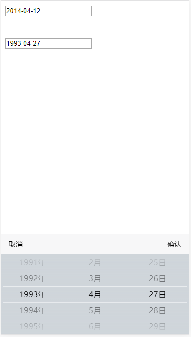

# datePicker
简单移动端日期选择
效果图如下：

# 用法
	<!DOCTYPE>
	<html>
		<head>
			<title>时间选择器</title>
			<meta name="viewport" content="width=device-width, initial-scale=1.0, maximum-scale=1.0, user-scalable=0">
			<link rel="stylesheet" type="text/css" href="./datepicker.css">
			
		</head>
		<body>
			<input type="text" name="date" readonly="readonly" id="date1" />
			   
			<input type="text" name="date" readonly="readonly" id="date2" />
			
			
		</body>
	</html>